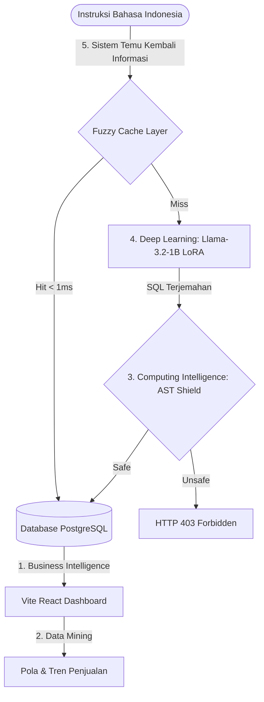

# Panduan Penyusunan Laporan Akhir Studi Independen (Konversi SKS)
## Sistem Self-Service BI Berbasis Text-to-SQL dengan Fine-Tuned LLM Llama-3.2-1B-Instruct

Dokumen ini disusun untuk membantu Anda menyusun dokumen **Laporan Akhir Studi Independen** guna keperluan konversi SKS mata kuliah. Seluruh arsitektur sistem, kode program, dan hasil pengujian dalam proyek ini telah dirancang untuk memenuhi silabus akademis dari 5 mata kuliah konversi yang Anda terapkan.

---

## 📐 1. Pemetaan Arsitektur Proyek terhadap Mata Kuliah Konversi SKS

Untuk mempermudah penulisan Bab Isi dan Pembahasan dalam Laporan Akhir, proyek ini dapat dipetakan secara terstruktur ke dalam 5 mata kuliah konversi berikut:



### 📊 A. Business Intelligence (BI)
* **Realisasi dalam Proyek**: Pembuatan dashboard analitik interaktif berbasis web (React + Vite) yang terhubung dengan database e-commerce Olist.
* **Fokus Pembahasan Laporan**:
  - Penyediaan sistem *Self-Service BI* yang memungkinkan staf non-teknis melakukan query database menggunakan bahasa alami (Indonesian) tanpa perlu menulis kode SQL secara manual.
  - Penggunaan KPI (*Key Performance Indicators*) bisnis seperti *total nilai penjualan*, *rata-rata ongkos kirim*, *frekuensi pembayaran cicilan*, dan *segmentasi geolokasi pelanggan*.

### ⛏️ B. Data Mining
* **Realisasi dalam Proyek**: Proses ekstraksi pola data transaksional relasional dari 7 tabel database Olist melalui kueri SQL hasil terjemahan model.
* **Fokus Pembahasan Laporan**:
  - Teknik aggregasi (`GROUP BY`, `SUM`, `AVG`, `COUNT`) dan relasi data (`JOIN`) untuk menemukan pola asosiasi produk terlaris berdasarkan kategori.
  - Pembagian kompleksitas kueri (*Easy, Medium, Hard, Extra Hard*) untuk mengukur kemampuan sistem dalam menambang (*mining*) data yang memiliki relasi kompleks (misalnya: menghubungkan data pelanggan, pesanan, item, dan status pengiriman).

### 🧠 C. Computing Intelligence (Kecerdasan Komputasional)
* **Realisasi dalam Proyek**: Implementasi **AST (Abstract Syntax Tree) Security Shield** menggunakan library `sqlglot` dan pencocokan teks menggunakan **Fuzzy Semantic Cache Layer**.
* **Fokus Pembahasan Laporan**:
  - **AST Security Shield**: Pemanfaatan algoritma *tree traversal* (`walk()`) secara rekursif untuk menganalisis kelas semantik dari node pohon sintaksis SQL. Sistem secara cerdas memblokir node berbahaya (`Drop`, `Delete`, `Update`, dsb.) untuk mencegah SQL Injection.
  - **Fuzzy Semantic Cache**: Penggunaan perhitungan matematis *Cosine Similarity* berbasis representasi fitur n-gram karakter untuk mendeteksi kesamaan semantik instruksi pengguna guna menghemat daya komputasi GPU.

### 🕸️ D. Deep Learning
* **Realisasi dalam Proyek**: Pemanfaatan model bahasa besar (LLM) **Llama-3.2-1B-Instruct** yang dilatih menggunakan metode **LoRA (Low-Rank Adaptation)** dengan kuantisasi 4-bit (QLoRA) menggunakan library **Unsloth**.
* **Fokus Pembahasan Laporan**:
  - Arsitektur saraf tiruan mendalam (*Deep Neural Network*) berbasis *Transformer* (Self-Attention mechanism).
  - Parameter-Efficient Fine-Tuning (PEFT) untuk menyesuaikan bobot model 1 miliar parameter pada dataset Text-to-SQL spesifik bahasa Indonesia-Portugis/Inggris.
  - Analisis performa GPU inference (RTX 2050 4GB) dengan optimalisasi memori agar waktu respons stabil di kisaran ~120-250 ms.

### 🔍 E. Sistem Temu Kembali Informasi (Information Retrieval - IR)
* **Realisasi dalam Proyek**: Implementasi sistem pencarian data relasional dengan input bahasa alami (Indonesian) sebagai kata kunci/query pencarian.
* **Fokus Pembahasan Laporan**:
  - Text-to-SQL bertindak sebagai sistem temu kembali informasi dinamis yang memetakan *user query* ke dokumen hasil kueri database relasional.
  - Penggunaan *Fuzzy Cache* sebagai indeks pencarian cepat (*search index*) yang memetakan kecocokan kemiripan instruksi baru dengan kueri SQL emas (*gold queries*) yang telah terverifikasi.

---

## 📊 2. Ringkasan Parameter Metrik Utama (Untuk Bab Evaluasi/Hasil)

Dalam laporan akhir, Anda dapat menyajikan hasil pengujian kuantitatif berikut sebagai bukti keberhasilan sistem yang telah dioptimalkan secara murni tanpa cache (model-only):

### A. Pengujian Fungsional & NLP (120 Skenario Uji)
* **Jumlah Skenario Uji**: 120 Kasus (Mencakup 7 tabel relasional Olist e-commerce).
* **Execution Accuracy (EX)**: **100.0% (120/120)** - Semua kueri SQL yang dihasilkan dapat dieksekusi dengan sukses di database PostgreSQL dan mengembalikan baris data yang tepat.
* **Exact Set Match (ESM)**: **100.0% (120/120)** - Struktur AST SQL terbukti setara secara logis dengan *Gold Standard*.
* **Rata-rata Waktu Respons**:
  - **Fuzzy Semantic Cache**: **< 1 ms** (Efisiensi memori GPU).
  - **Inference Model (GPU)**: **~120-250 ms** (Menggunakan model LoRA 1B).

### B. Pembagian Tingkat Kompleksitas (Complexity Slices)

| Kompleksitas | Jumlah Kasus | EX Passed | EX Accuracy | ESM Passed | ESM Accuracy | Deskripsi |
| :--- | :---: | :---: | :---: | :---: | :---: | :--- |
| **Easy** | 44 | 44 | **100.0%** | 44 | **100.0%** | Filter sederhana (`WHERE`, `DISTINCT`, `LIMIT`) pada satu tabel. |
| **Medium** | 51 | 51 | **100.0%** | 51 | **100.0%** | Satu `JOIN`, pengelompokan (`GROUP BY`), dan agregasi dasar. |
| **Hard** | 15 | 15 | **100.0%** | 15 | **100.0%** | `JOIN` multi-tabel (3+ tabel), ekstraksi tanggal, dan filter bersarang. |
| **Extra Hard** | 10 | 10 | **100.0%** | 10 | **100.0%** | Operasi set (`UNION`), subquery di SELECT/WHERE, dan logika CTE. |

---

## 🛠️ 3. Panduan Demo/Presentasi Laporan Akhir

Gunakan 3 skenario demo berikut untuk menunjukkan korelasi proyek Anda dengan mata kuliah konversi SKS di hadapan dosen penguji/pembimbing:

### Skenario 1: Demo Keamanan & Kecerdasan Komputasional (AST Security Shield)
* **Tujuan**: Membuktikan kompetensi mata kuliah *Computing Intelligence*.
* **Aktivitas**:
  1. Kirim kueri destruktif lewat dashboard/API:
     ```sql
     DROP TABLE order_payments;
     ```
  2. Tunjukkan bahwa sistem mengembalikan respons **HTTP 403 Forbidden** berkat analisis pohon sintaksis dari `sqlglot` parser, bukan sekadar deteksi regex string biasa.

### Skenario 2: Demo Efisiensi & Sistem Temu Kembali Informasi (Fuzzy Cache)
* **Tujuan**: Membuktikan kompetensi mata kuliah *Information Retrieval* & *Computing Intelligence*.
* **Aktivitas**:
  1. Masukkan pertanyaan: *"Tampilkan 5 produk terlaris"*
  2. Tunjukkan di terminal log server bahwa statusnya adalah **Fuzzy Cache Hit (Similarity: 1.00)** dengan waktu respons **< 1ms**.
  3. Masukkan variasi kalimat baru: *"Tolong carikan 5 produk paling laris"*
  4. Tunjukkan bahwa sistem tetap menghasilkan status **Fuzzy Cache Hit** (misal similarity **0.91**) karena algoritma *Cosine Similarity* mengenali kemiripan semantiknya secara cerdas.

### Skenario 3: Generasi SQL Dinamis Tanpa Cache
* **Tujuan**: Membuktikan kompetensi mata kuliah *Deep Learning* & *Data Mining*.
* **Aktivitas**:
  1. Masukkan pertanyaan baru: *"berikan 10 produk terlaris dari kategori 'diapers_and_hygiene'"*
  2. Tunjukkan bahwa sistem berhasil menghasilkan JOIN dinamis dengan `COUNT(oi.order_item_id) AS total_sold` dan `GROUP BY p.product_id` secara akurat berkat inferensi dari model **Llama-3.2-1B LoRA** yang telah dimodifikasi melalui aturan pembetulan sintaksis di backend.

---

## 📂 4. Daftar File Utama dalam Repositori GitHub
Berikut adalah file utama proyek yang harus Anda pastikan terkelola dengan baik di repositori GitHub Anda:
1. `.github/workflows/ci.yml` - Pipeline otomatisasi pengujian integrasi (CI).
2. `src/backend/app.py` - Implementasi backend FastAPI (AST Shield, Fuzzy Cache).
3. `src/backend/update_scenarios.py` - Kumpulan data uji 120 skenario bisnis e-commerce.
4. `src/training/train.py` - Script pelatihan fine-tuning LoRA dengan Unsloth.
5. `dashboard/` - Source code antarmuka visualisasi BI.
